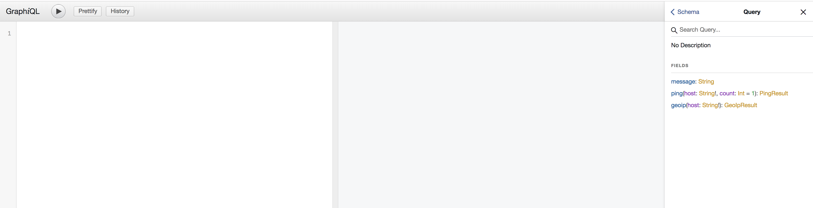

# Janus

A proof of concept for a "mono-repo" containing a GraphQL instance
and separate works/services to handle small tasks.  The API takes an IP or
hostname and provides various information about the provided address, such as
ping and geolocation.

## Getting Started

These instructions will get you a copy of the project up and running on your local machine for development and testing purposes. See deployment for notes on how to deploy the project on a live system.

### Prerequisites

What things you need to install the software and how to install them

```
RabbitMQ Server
A token for IP Data API (https://ipdata.co/)
```

### Installing

Clone the project

```
git clone git@github.com:TNowalk/janus.git
cd janus
```

The repo is broken up into `app` and `services`.  Each service and the app is its
own package, each with it's own requirements.  As such, an `npm install` will be
needed in each package.  There is also common packages needed for development,
these are found in the root directory.

```
# Install global packages
npm install

# Install packages for GraphQL API and compile
cd app
npm install && npm run build

# Install packages for GeoIP service and compile
cd ../services/geoip
npm install && npm run build

# Install packages for Ping service and compile
cd ../ping
npm install && npm run build
```

Each package has a `.env.example` file, these should be renamed or copied to `.env`.
If the RabbitMQ broker is running on local host, the only env variable that will
need to be updated is in geoip service, add your API token to `IPDATA_API_KEY`.  If
your RabbitMQ is hosted elsewhere, be sure to update the RABBIT_URL in all `.env` files.

For local development, all three packages can be run with `npm start` (In separate windows/screens).

If all was successful, the GraphQL API should be running at http://localhost:4000/api



After any changes are made, the TypeScript will need to be transpiled.  As of
right now, this is a manual process using `npm run build`.

There are two **Query** functions, `ping` and `geoip` which can be used.  The available
fields are:

#### Ping

```
alive: Boolean
output: String
time: String
min: String
max: String
avg: String
host: String
ip: String
```

#### GeoIp

```
error: Boolean
message: String
ip: String
city: String
region: String
country: String
continent: String
latitude: String
longitude: String
asn: String
organization: String
postal: String
flag: String
emojiFlag: String
languages: [{
  name: String
  native: String
}],
currency: {
  name: String,
  code: String,
  symbol: String,
  native: String,
}
timezone: {
  name: String,
  abbr: String,
  offset: String,
  isDst: Boolean,
  currentTime: String,
}
threat: {
  isTor: Boolean,
  isProxy: Boolean,
  isAnonymous: Boolean,
  isKnownAttacker: Boolean,
  isKnownAbuser: Boolean,
  isThreat: Boolean,
  isBogon: Boolean
}
```

With GraphQL, any combination of fields can be selected in a single call.  Here is an example call and response:

```
{
  ping(host:"www.google.com", count:2) {
    alive
    output
    time
    min
    max
    avg
  }
  geoip(host:"www.google.com") {
    ip
    city
    region
    country
    organization
    emojiFlag
    message
    error
  }
}
```

Response
```
{
  "data": {
    "ping": {
      "alive": true,
      "output": "PING www.google.com (64.233.169.105): 56 data bytes\n64 bytes from 64.233.169.105: icmp_seq=0 ttl=42 time=51.516 ms\n64 bytes from 64.233.169.105: icmp_seq=1 ttl=42 time=48.203 ms\n\n--- www.google.com ping statistics ---\n2 packets transmitted, 2 packets received, 0.0% packet loss\nround-trip min/avg/max/stddev = 48.203/49.859/51.516/1.657 ms\n",
      "time": "51.516",
      "min": "48.203",
      "max": "51.516",
      "avg": "49.859"
    },
    "geoip": {
      "ip": "64.233.169.147",
      "city": "",
      "region": "",
      "country": "United States",
      "organization": "Google LLC",
      "emojiFlag": "🇺🇸",
      "message": null,
      "error": false
    }
  }
}
```

#### Error Handling
The `ping` endpoint does not provide any errors, the host (ip or hostname) will
either be pingable or not (`alive`).  The `geoip` endpoint, however, does have
some simple error handling.  Either an ip or hostname can be provided, if an
invalid IP is provided the `error` property will be `true` and an appropriate
`message` will be provided.

Example response for `192.168.256`:
```
{
  "data": {
    "geoip": {
      "ip": null,
      "city": null,
      "region": null,
      "country": null,
      "organization": null,
      "emojiFlag": null,
      "message": "192.168.256 does not appear to be an IPv4 or IPv6 address",
      "error": true
    }
  }
}
```

## Deployment

Each service and the app have a separate Dockerfile.  Each needs to be built
and can then be run on separate hosts.

**App**
```
cd ./app
docker build -t <image-name> .
docker run --name <instance-name> --env RABBIT_URL=<rabbit-url> -p 5672:5672 -p 4000:4000 <image-name>
```

**GeoIp**
```
cd ./services/geoip
docker build -t <image-name> .
docker run --name <instance-name> --env RABBIT_URL=<rabbit-url> --env IPDATA_URL=https://api.ipdata.co --env IPDATA_API_KEY=<ipdata-api-key> -p 5672:5672 -d <image-name>
```

**Ping**
```
cd ./services/ping
docker build -t <image-name> .
docker run --name <instance-name> --env RABBIT_URL=<rabbit-url> -p 5672:5672 -d <image-name>
```

## Things To Do

* Break up the schema into multiple schemas and modularize the resolvers
* Add timeouts to the RPC calls in the API - so when services are down the API
doesn't hang indefinitely
* Add better error checking/handling for missing Environment variables
* Add README to the services
* Figure out a better way to do the deployments with Docker to support multiple
instances run on same server
* Automate the build process
  * Use gulp to watch files and re-compile project after changes
  * For build process, tsc -> docker build

## License

This project is licensed under the MIT License
